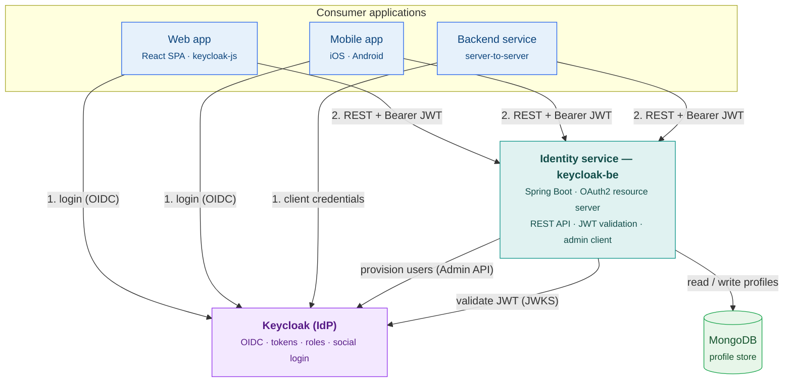

# Architecture — Keycloak Identity Microservice

## Goal

Build Keycloak into a **self-contained, reusable identity microservice** that any application — a web SPA, a mobile app, or another backend — can integrate with quickly. Consuming apps get authentication, JWT-based authorization, and user/profile management through open standards (OIDC / OAuth2 / JWT), with no knowledge of Keycloak internals and no proprietary SDK lock-in.

## Components

| Component | Role | Tech |
|---|---|---|
| **Consumer apps** | Any client that needs auth & profiles | React SPA, mobile, server-to-server |
| **Identity service** (`keycloak-be`) | The microservice: REST API, JWT validation (resource server), Keycloak admin client | Spring Boot, OAuth2 |
| **Keycloak** | Externalized identity provider: credentials, token issuance, sessions, roles, social login | Keycloak 25.0.0 |
| **MongoDB** | Application-owned profile store | MongoDB 7.0 |

## Microservice diagram

## Integration flow

1. **Authenticate** — the client runs the standard OIDC flow against Keycloak (browser redirect for user-facing apps, `client_credentials` for backends) and receives a signed JWT access token.
2. **Call the service** — the client calls the identity service's REST API with `Authorization: Bearer <token>`. The service, acting as an OAuth2 resource server, validates the token's signature and issuer against Keycloak's JWKS endpoint.
3. **Provision & enrich** — for registration and admin operations the service uses a service-account (`client_credentials`) token to call the Keycloak Admin API (create user, reset password, assign roles), then mirrors the result into the MongoDB profile store.
4. **Serve profiles** — profile reads/writes are served from MongoDB, keyed by the Keycloak `userId`, keeping business profile data separate from the identity record.

## Why a microservice

- **Independent deployability & scaling** — runs and scales separately from any consuming application.
- **Single source of truth for identity** — one registration/login/RBAC implementation reused by every app.
- **Loose coupling via standards** — clients depend only on OIDC/OAuth2/JWT and a small REST contract, not on Keycloak internals.
- **Bounded data ownership** — the service owns its profile store; no other service writes to it directly.
